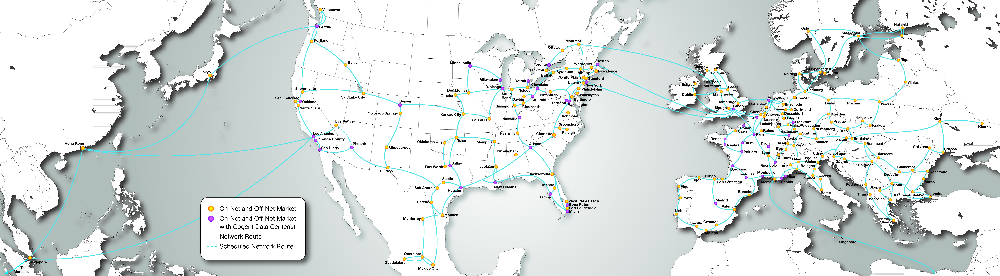

# Network Constellations

I used [Zenmap](https://nmap.org/zenmap/) to produce four network maps. [Nmap](https://nmap.org), Zenmap's originator is a tool commonly used by hackers to *map* a network of computers. Zenmap abstracts Nmap by providing a GUI, or graphical user interface, to its users. For that reason, it is often considered childish by the more hardcore hackers who prefer a black terminal screen with green text to be the only true way to hack apart a system. In terms of a computer network, a map discloses which computers are connected to each other. It gives an authorized administrator (or unauthorized hacker) an idea of how the network is laid out. While both tools provide a powerful toolset for hacking, I used a very basic functionality of Zenmap to trace the network route between me and a variety of other hosts. Anyone can do this with the Linux command `traceroute`, but Zenmap produces beautifully interactive maps with every scanning session.
The maps give viewers a unique perspective on how the Internet behind their computers is structured. They give a virtual image of how "close" one is to a website by illustrating the number of "hops" between computers. However, the maps do not adhere to any physical model of where the Internet's cables lie. In fact, the maps do not demand any kind of rigid structure. In the Zenmap topography, the user can click on any node in the network to center the map around it. The rest of the map is animated and redrawn with the selected node at the heart. The Zenmaps are dynamic constellations of a sliver of the Internet.

### What is the Internet?

The maps help us explore an expansive and responsive space.

In Rebecca Solnit's chapter **Citizens of the Streets: Parties, Processions, and Revolutions**, she points out that the words "media" and "mediate" share the same etymological roots (216). In the terms of the Internet, the media can be the computers that serve websites. They mediate by providing content to users. The providers' content is often described as *what the people want*. This understanding is naive. Even if a user were privileged enough to retrieve the content they desire and nothing more, that leaves the entire **Internet** and its mechanisms out of the mediation process. *How* information travels is at least as political as the information itself.

#### Public space

Solnit continues with a discussion of the spaces in which people involve themselves. She writes, "direct political action in real public space may be the only way to engage in unmediated communication with strangers" (216). Public space is designed to save us from the mediating overlords. That matches the core idea behind early Internet innovators. It used to be a public place where information was as free as possible. There is a fantastic scene in the TV series **Halt and Catch Fire** in which the founder of an early (1980s) Internet company passionately defends her site as a place where people could be themselves with no adverse social or political expectations. The debates about net neutrality were about whether the Internet is a public or private entity. The infrastructure that giant Internet Service Providers (ISPs) have in place came from significant help from the federal government. It makes sense, then, that the Internet be considered a public utility. Net neutrality wins!

It's not that simple.

#### The components of the Internet

"The Internet is everywhere!" When people say this, they usually refer to how they can find a wireless hotspot at every street corner. For them, the Internet flies through the air. As Shannon Mattern points out in [Infrastructural Tourism](https://placesjournal.org/article/infrastructural-tourism/), "wireless" is mostly wired. We just don't see the wires. In its physical reality, the Internet's brain is made of huge data centers that house rows and rows of servers. Those rooms smell like industrial air conditioning and ozone, and they look like lots of black boxes with blinking LEDs. The Internet's neurons can be found in the miles of fiber optic cable beneath our feet. The wireless routers that serve us the *invisible* Internet are only its most exterior mouths and ears.

Ingrid Burrington reveals how certain people see the wires in her piece, [How to See Invisible Infrastructure](https://www.theatlantic.com/technology/archive/2015/08/how-to-see-invisible-infrastructure/401204/). She notes that ISPs do not tell anyone where their data centers--the Internet brains--live. They keep them locked down and secure. However, ISPs make their cables easy to find in case excavators need to construct or destruct the land around them. The people that mark the paths of the neurons are called *locators*. The place that a locator maps? A *locate*. Locators' findings never make it back to a map. Locators never trust another locator's markings. This model might seem inefficient, but the redundancy is necessary in high risk situations. The physical maps of Internet cable are dynamic. It is noteworthy that the object of a locator's search functions as a noun and as a verb. Locators understand the Internet as an active form.

Keller Easterling discusses active forms in his work **Extrastatecraft: The Power of Infrastructure Space**. He writes, "Active forms do not require an event or a movement. They are active even when they are static because that activity may be latent, serial, and indeterminate. Active forms might be manifest in movement, but they might describe agency, practices, or capacities that are not bound by a single event" (pg. 255). Active forms can adapt. They can embody power.

***The Internet is an active form.***

#### Understanding the Internet as an active form

We can use the Internet's surronding physical infrastructure to understand how it acts.

In his piece **The Experience of Living in Cities**, Stanley Milgram describes the following characteristics evident in large cities:
- large numbers of people
- high population density
- heterogeneity of population

These factors produce an overload of information for the common user. Since it is inefficient to process all of this information by oneself, several mechanisms are in place to map, reduce, and filter it. Some of these mechanisms take the form of built structures. The Internet and its extensive content follow this model.

### The network constellations

As noted above, the maps are based on traceroute results. Traceroute maxes out at 30 'hops' by default, and I used this default value to keep the maps easy to visualize. They are essentially visual representations of how far away my computer is from the computer that hosts each of the websites.

A 'hop' is measured when one computer on the Internet forwards data to another computer.

I noticed that a lot of my Internet traffic went through an ISP called Cogent Communications. Here is a map of their network brains and neurons.

Most of the maps contain the router that connects me with the rest of the Internet at the center. All of my Internet traffic follows the same path to that router before diverging to find its destination. 5 hops away, you will find me, represented by the black dot labeled `localhost`.

To get a sense of these maps as dynamic constellations, it is advised that you download Zenmap and the folders in the `zenmap-scans` directory on this site. Then, you will be able to interact with each node in the map. Instructions for this method are below.

#### Walkthrough
1. [Download Nmap and Zenmap](https://nmap.org/download.html). The Nmap download package comes with Zenmap.
2. Install it following [these instructions](https://nmap.org/book/install.html) for your operating system.
3. Start the Zenmap application. I had some trouble doing starting Zenmap right from the `Applications` folder on Mac OSX High Sierra. When I run the application, I followed these steps:
  1. Open Finder.
  2. Navigate to the `Applications` folder.
  3. Right-click on the Zenmap icon. Click `Show Contents`.
  4. Navigate through `Contents -> MacOS`.
  5. Open the file called `Zenmap`. It will start a terminal window. Type in your password when prompted. Zenmap will start.
  6. In Zenmap, Click `Scan -> Open Scan`. Navigate to the location where you saved the scan folders from this site.
  7. When you have found the desired folder (i.e. `netflix-scans`), select it and click `Open Directory`.
  8. Click the `Topology` tab. You can now interact with my scan results.

Zenmap legend:

#### Some personal history
These maps connect me to some sites I have recently visited. The world around me.
<!-- <object data="https://github.com/mgottsacker34/digital_native/blob/gh-pages/pubication-3-files/maps/scan-matt-0.pdff" type="application/pdf" width="700px" height="700px">
    <embed src="https://github.com/mgottsacker34/digital_native/blob/gh-pages/pubication-3-files/maps/scan-matt-0.pdf">
        This browser does not support PDFs. Please download the PDF to view it: <a href="https://github.com/mgottsacker34/digital_native/blob/gh-pages/pubication-3-files/maps/scan-matt-0.pdf">Download PDF</a>.

    </embed>
</object> -->
Me (`localhost`) at the center:

Same as above, but fisheye perspective:

Common router at the center:

#### St. Louis companies
How close is St. Louis? All of these companies and organizations are based in St. Louis, but their locations on the Internet are sometimes very far.

Fisheye perspective:

More of a web perspective:

#### World governments
How far are other countries, really? Most countries are not many hops away, as it turns out.

Me at the center:

The United States White House at the center:

#### Where is Netflix?
This map demonstrates the active form of the Internet. With every scan, I hit `www.netflix.com` or `netflix.com` as the endpoint. With only a handful of requests over the span of an hour, it was often traced to different locations. I chose to map Netflix because it is a major content provider, and the way it engineers its content distribution is innovative and interesting. In order to stream large files to enormous numbers of users, Netflix needs to be dynamic. It must respond to load changes and always try to serve content closest to the user to ensure a high quality of service.

My common router at the center:

Fisheye perspective:

---
## Further (on Internet security)...

In **A Burglar's Guide to the City**, Geoff Manaugh argues that cities get the crime for which they are designed. The Internet is founded in the fast exchange of information for *free* and with a certain promise of *anonymity*. The anonymity of the early Internet was possible because people didn't know how to hack it. Once the experts figured out the Internet offered no security, they had to add security on top of it. Security became a feature rather than a requirement. That trend continues today in many spaces.

Find problem, implement patch, repeat.

The Internet is not designed for security, so it can expect break-ins as quick as any other service.
